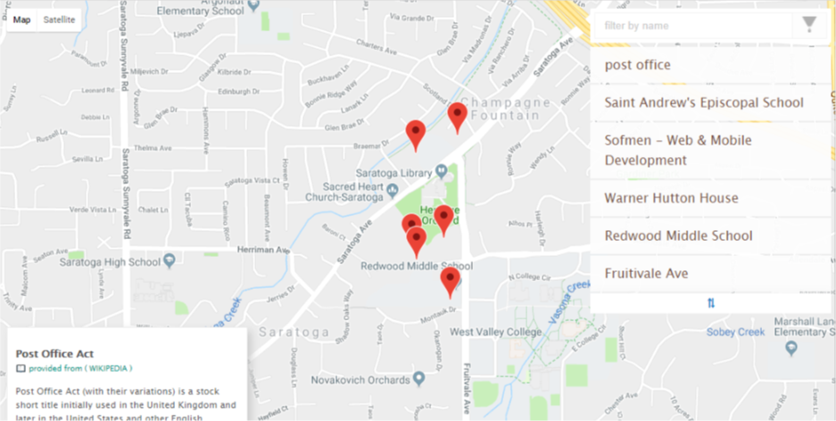

# Frontend Nanodegree neighbourhood Map
 
 



Overview
--------
Using  `Knockout` as javascript framework and Google maps
and **wikipedia** *API* as a third party library

<br>

Installation
------------

* for a rapid view access to the website you can click [link](https://hosamsam.github.io/nanodegree-neighbourhod-map/src/index.html)
    the project hosted o Github Pages.
 
 <br>

* Test the project source code on your local machine
 
 <br>

1. first clone the project

```bash
$ git clone https://github.com/hosamsam/nanodegree-neighbourhod-map.git
```

2. navigate your shell working directory to the project path
```bash
$ cd path/to/projet/foldename
# or just in case you hadn't changed the name
$ cd nanodegree-neighbourhod-map
```
3. install dependencies & run the project

```bash
$ npm install
$ npm start # to run dev live reloading with default browser
```

<br>

License
-------
This project is under [MIT LICENSE](./LICENSE)